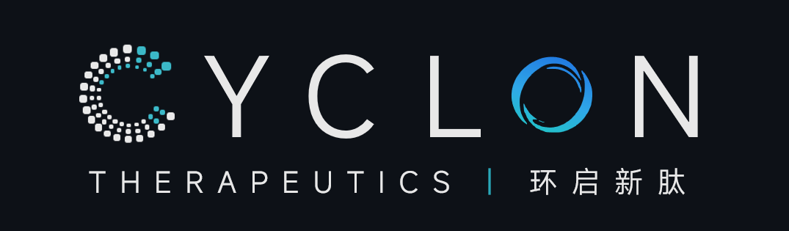

  

# Cyclon Therapeutics

**AI-driven design of cyclic peptide therapeutics.**

## About Us

Cyclon Therapeutics is a biotechnology R&D organization focused on the discovery and optimization of cyclic peptides and macrocyclic therapeutics. We build AI models and computational tools that address the core challenges of peptide drug design — enabling sequences and structures that bind tightly, permeate cells, and survive in vivo.

## Focus Areas

- 🧬 **De Novo Peptide Design** — generative and optimization models for cyclic peptide sequences and structures
- 🚪 **Membrane Permeability** — ML models predicting passive permeability of macrocycles to unlock intracellular targets
- 🤖 **AI for Drug Discovery** — molecular property prediction, active learning, and multi-objective optimization
- 🧪 **Bench–Model Integration** — close coupling of predictive models with experimental validation for faster design–make–test cycles

## Featured Projects

Our public tools and open-source projects live in this organization. Highlights:

| Project | Description | Language |
|---------|-------------|----------|
| [CycDelta](https://github.com/cyclontx/CycDelta) | Machine learning models for predicting membrane permeability of cyclic peptides. | Python |

<!-- To add another project, copy a row below and fill it in:
| [repo-name](https://github.com/cyclontx/repo-name) | One-line description of the repository. | Python |
-->

## Get in Touch

- 📫 Reach us on GitHub by opening an issue or discussion in the relevant repository
- 🏢 Organization profile: [github.com/cyclontx](https://github.com/cyclontx)

---

<em>Cyclon Therapeutics — designing next-generation macrocyclic therapeutics with AI.</em>

